## Transfer learning with DenseNet121

#### Architecture
```
DenseNet121 architecture
input_shape: (None, 224, 224, 3)
output_shape: (None, 7, 7, 1024)
_____________
max_pool
trainable: True
input_shape: (None, 7, 7, 1024)
output_shape: (None, 1024)
_____________
dense_1
trainable: True
input_shape: (None, 1024)
output_shape: (None, 256)
_____________
dropout_1
trainable: True
input_shape: (None, 256)
output_shape: (None, 256)
_____________
batch_normalization_1
trainable: True
input_shape: (None, 256)
output_shape: (None, 256)
_____________
dense_2
trainable: True
input_shape: (None, 256)
output_shape: (None, 6)
```
## First training

#### Short training period - 10 epochs
- L2 weights regularization: 0.01
- DenseNet121 all trainable
- Adam optimizer
- learning rate = 0.0001
- epsilon = default

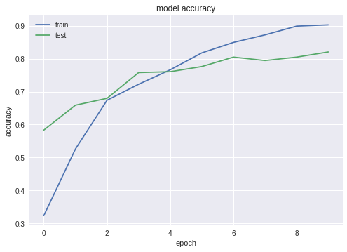
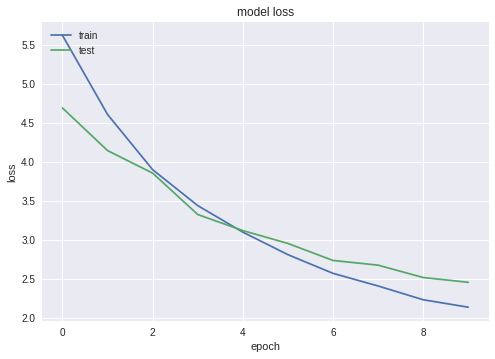

#### First long training period - 50 epochs
- L2 weights regularization: 0.01
- DenseNet121 all trainable
- SGD optimizer
- learning rate = 0.0001
- Nesterov momentum = 0.9

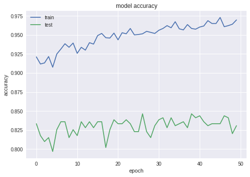
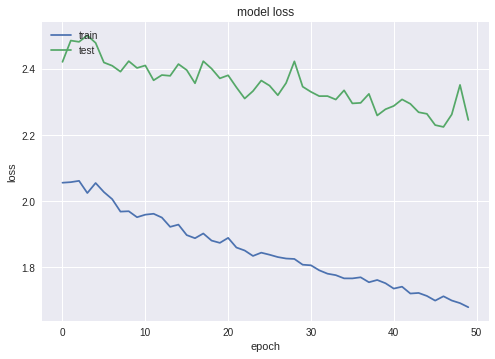

#### Second long training period - 100 epochs
- L2 weights regularization: 0.05
- DenseNet121 all trainable
- SGD optimizer
- learning rate = 0.0001
- Nesterov momentum = 0.9

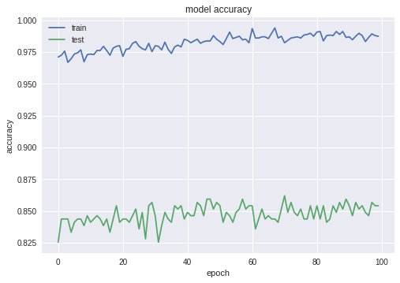
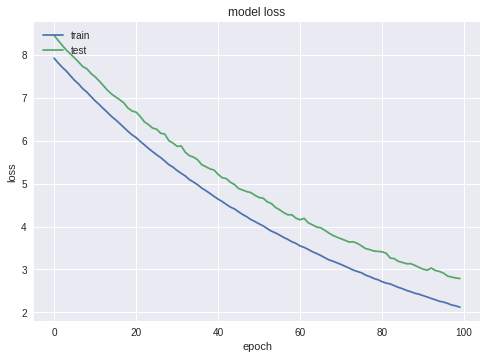

#### Third long training period - 50 epochs
- L2 weights regularization: 0.05
- DenseNet121 all trainable
- SGD optimizer
- learning rate = 0.0001
- Nesterov momentum = 0.9

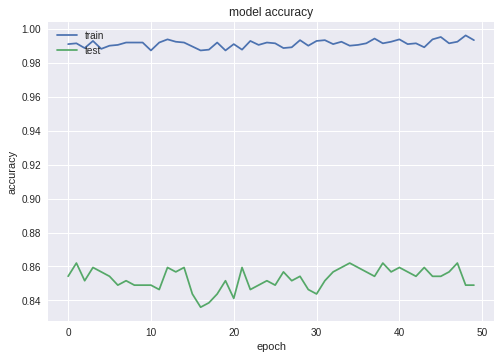
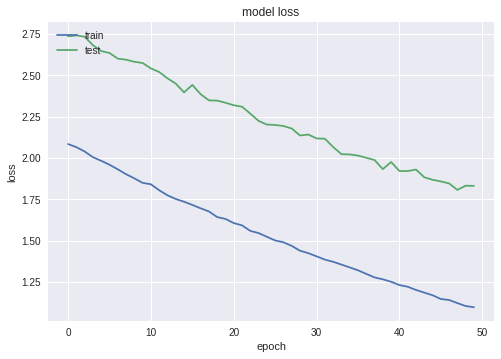

#### Classification report
```
              precision    recall  f1-score   support

   cardboard       0.94      0.97      0.95        61
       glass       0.92      0.89      0.91        76
       metal       0.87      0.97      0.92        62
       paper       0.82      0.93      0.87        90
     plastic       0.91      0.66      0.76        73
       trash       0.32      0.32      0.32        22

   micro avg       0.85      0.85      0.85       384
   macro avg       0.79      0.79      0.79       384
weighted avg       0.85      0.85      0.85       384
```
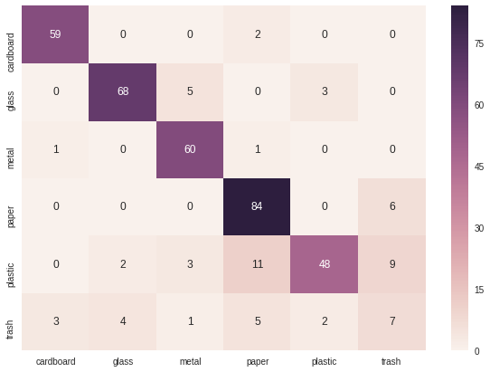

## Second training

#### Short training period - 20 epochs
- L2 weights regularization: 0.01
- DenseNet121 all trainable
- Adam optimizer
- learning rate = 0.0005
- epsilon = default

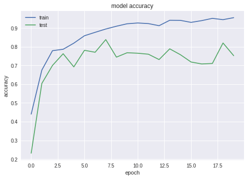
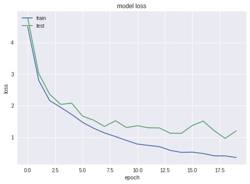

#### First long training period - 50 epochs
- L2 weights regularization: 0.05
- DenseNet121 all trainable
- SGD optimizer
- learning rate = 0.0001
- Nesterov momentum = 0.9

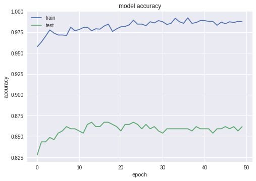
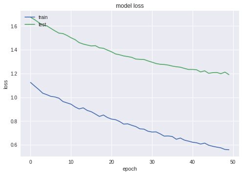

#### Second long training period - 50 epochs
- L2 weights regularization: 0.1
- DenseNet121 all trainable
- SGD optimizer
- learning rate = 0.0001
- Nesterov momentum = 0.9

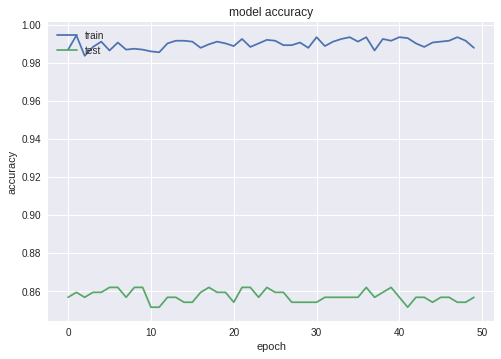
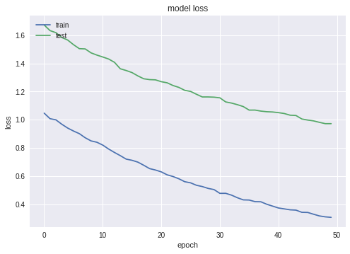

#### Classification report
```
              precision    recall  f1-score   support

   cardboard       0.91      0.97      0.94        61
       glass       0.97      0.93      0.95        76
       metal       0.87      0.94      0.90        62
       paper       0.90      0.94      0.92        90
     plastic       0.96      0.63      0.76        73
       trash       0.27      0.45      0.34        22

   micro avg       0.86      0.86      0.86       384
   macro avg       0.81      0.81      0.80       384
weighted avg       0.89      0.86      0.86       384
```
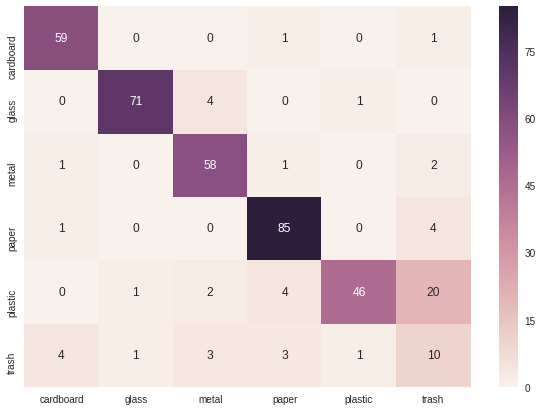