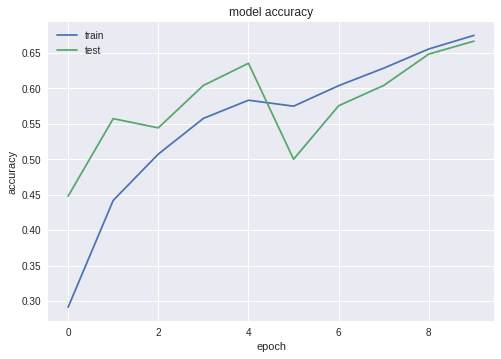
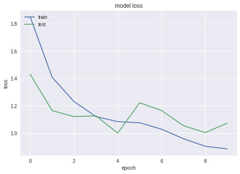
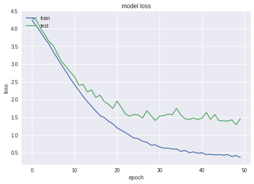
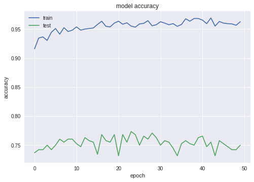
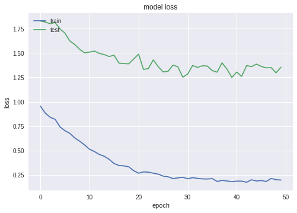
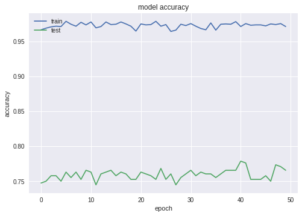
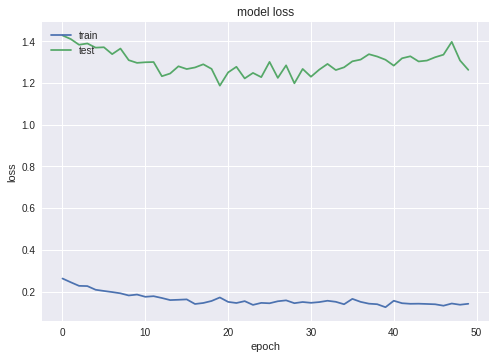

## Using transfer learning with VGG-19
Following [this paper](http://cs230.stanford.edu/projects_spring_2018/reports/8290808.pdf) we tried to use transfer 
learning using the VGG-19 architecture pretrained with imagenet. On a first try with few epochs it seems to perform 
better than the model based on trashnet architecture.

The list of layers with corresponding input/output shape is the following:
```
vgg19
trainable: False
input_shape: (None, 224, 224, 3)
output_shape: (None, 512)
_____________
dense_1
trainable: True
input_shape: (None, 512)
output_shape: (None, 256)
_____________
dropout_1
trainable: True
input_shape: (None, 256)
output_shape: (None, 256)
_____________
batch_normalization_1
trainable: True
input_shape: (None, 256)
output_shape: (None, 256)
_____________
dense_2
trainable: True
input_shape: (None, 256)
output_shape: (None, 6)
_____________
```

### First training period - 10 epochs: 
- No weights regularization
- learning rate = 0.005
- VGG-19 network last layers unfrozen
- epsilon = 0.1




### Second training period - 50 epochs
- L2 weights regularization: 0.01
- learning rate = 0.005
- VGG-19 network last layers unfrozen
- epsilon = 0.1





### Third training period - 50 epochs
- L2 regularization: 0.05
- learning rate = 0.001
- VGG-19 network last layers unfrozen
- epsilon = 0.1





### Fourth training period - 50 epochs
- L2 regularization: 0.1
- learning rate = 0.0005
- VGG-19 network last layers unfrozen


